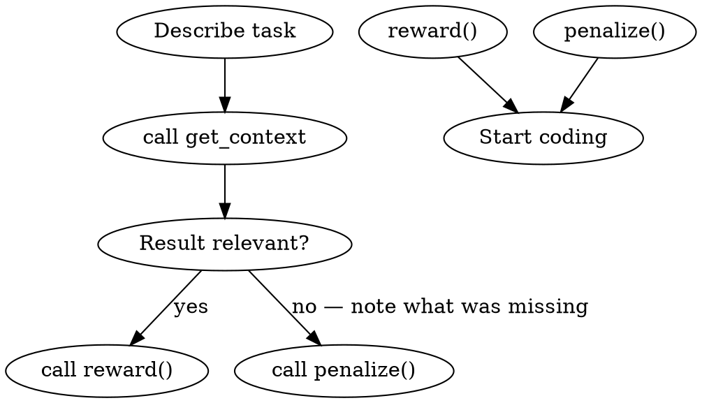
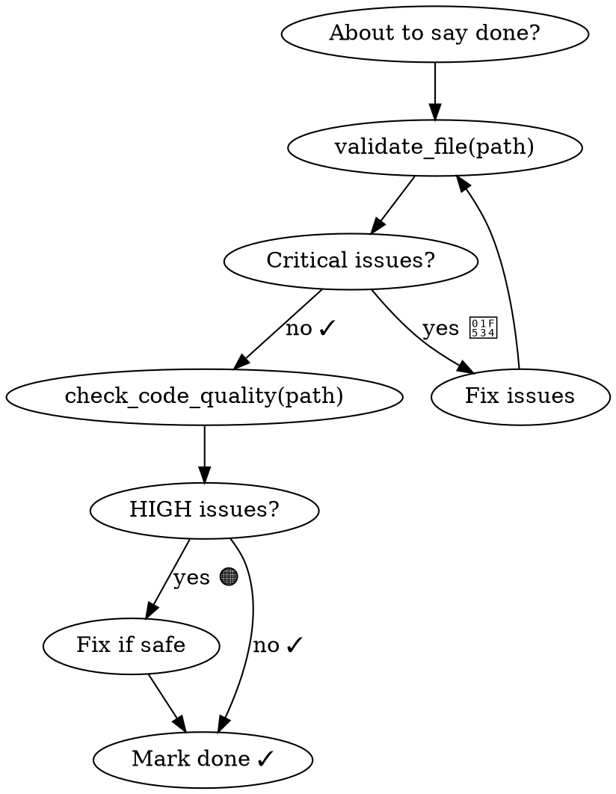

# Lucid Enforcement Implementation Plan (v1.14.0)

> **For agentic workers:** REQUIRED SUB-SKILL: Use superpowers:subagent-driven-development (recommended) or superpowers:executing-plans to implement this plan task-by-task. Steps use checkbox (`- [ ]`) syntax for tracking.

**Goal:** Make Lucid usage unavoidable — auto-sync on file change, enforcement via superpowers-style skills, HTTP daemon for direct shell access.

**Architecture:** Three layers: (1) Skills rewritten with HARD-GATEs so Claude cannot skip them; (2) `lucid-sync` hook script reads stdin from PostToolUse and syncs directly — HTTP if daemon is running, SQLite fallback otherwise; (3) HTTP server + `lucid watch` daemon make tools accessible from shell without going through Claude.

**Tech Stack:** TypeScript (ES modules, Node16), Express 4, chokidar 3, better-sqlite3, existing Lucid handlers

---

## File Map

| File | Action | Responsibility |
|------|--------|----------------|
| `skills/lucid-start/SKILL.md` | create | SessionStart enforcement — HARD-GATE, loads context before any task |
| `skills/lucid-context/SKILL.md` | rewrite | get_context before coding — superpowers-style |
| `skills/lucid-audit/SKILL.md` | rewrite | validate before done — superpowers-style |
| `skills/lucid-plan/SKILL.md` | rewrite | plan before coding — superpowers-style |
| `skills/lucid-webdev/SKILL.md` | rewrite | web dev tools — superpowers-style |
| `skills/lucid-security/SKILL.md` | rewrite | security scan — superpowers-style |
| `src/lucid-sync.ts` | create | Standalone hook script: reads stdin → HTTP → SQLite fallback |
| `src/http/server.ts` | create | Express HTTP server, port 7821, starts on demand |
| `src/http/routes.ts` | create | Route adapters — thin wrappers over existing handlers |
| `src/tools/init.ts` | modify | Add global skills install (~/.claude/skills/) + updated hook |
| `package.json` | modify | Add lucid-sync bin + express + chokidar deps |
| `src/index.ts` | modify | Check argv for `watch`/`status`/`stop` — route to CLI handlers |

> **Note on global plugin:** Claude Code loads skills from `~/.claude/skills/<name>/SKILL.md` globally. `init_project` will install Lucid skills there (in addition to per-project `.claude/skills/`), making them active in every project.

---

## Phase 1: Skills Rewrite + Global Install

### Task 1: Create `lucid-start` enforcement skill

**Files:**
- Create: `skills/lucid-start/SKILL.md`

- [ ] **Step 1: Create the skill file**

```markdown
---
name: lucid-start
description: MANDATORY at every session start and before any coding task — loads project context via Lucid before Claude reads any file or writes any code
argument-hint: "[optional: what you are about to work on]"
---

<EXTREMELY-IMPORTANT>
You MUST complete ALL steps below BEFORE:
- Reading any source file
- Writing or editing any code
- Answering any coding question
- Creating any plan or task

This is not optional. There are no exceptions. "I'll do it after" is not acceptable.
</EXTREMELY-IMPORTANT>

## Steps (all mandatory, in order)

### 1. Check what changed recently
```
get_recent(hours=24)
```
This shows files modified since your last session. Review the list.

### 2. Reload project overview
```
recall(query="project overview architecture")
```

### 3. If working on a specific task — load relevant context
```
get_context(query="<describe what you are about to work on>", maxTokens=4000)
```
Skip only if the user's request is purely conversational (no code involved).

### 4. Announce readiness
Say: "✓ Lucid active — context loaded ([N] files)"

---

## After EVERY file write or edit

Call `sync_file` IMMEDIATELY after the tool call completes:
```
sync_file(path="<exact path of file you just wrote or edited>")
```

**Do this before anything else.** Before the next file. Before the next thought. Now.

If you modified multiple files (refactor, git pull): call `sync_project()` instead.

---

## Before marking any task as done

Run `lucid-audit` before saying "done", "fixed", "complete", or "implemented":
```
validate_file(path="<file>")
check_code_quality(path="<file>")
```

Fix all 🔴 CRITICAL issues before proceeding.

---

## Trigger conditions

**USE this skill:**
- At the start of every new conversation
- When resuming work after a break
- When the user says "let's work on X" or similar

**DO NOT USE for:**
- Pure conversation with no code involved
- Answering theoretical questions
```

- [ ] **Step 2: Verify file was created**

```bash
cat skills/lucid-start/SKILL.md | head -5
```
Expected: frontmatter with `name: lucid-start`

- [ ] **Step 3: Commit**

```bash
git add skills/lucid-start/SKILL.md
git commit -m "feat: add lucid-start enforcement skill (SessionStart HARD-GATE)"
```

---

### Task 2: Rewrite `lucid-context` skill (superpowers-style)

**Files:**
- Modify: `skills/lucid-context/SKILL.md`

- [ ] **Step 1: Overwrite with superpowers-style content**

```markdown
---
name: lucid-context
description: Use BEFORE starting any coding task — retrieves relevant context via TF-IDF retrieval. HARD-GATE: do not read files manually before calling get_context.
argument-hint: "[what you are working on]"
---

<HARD-GATE>
Do NOT open any source file, read any code, or start implementation
until you have called get_context and reviewed the result.
Reading files manually when Lucid is available wastes tokens and misses context.
</HARD-GATE>

## When to invoke this skill

**INVOKE when:** about to work on a feature, fix a bug, understand a module, or any coding task
**DO NOT INVOKE for:** pure conversation, reading docs, non-code questions

## Steps



### 1. Call get_context
```
get_context(query="<concise description of what you are working on>", maxTokens=4000)
```

Use `dirs` to narrow scope when you know the area:
```
get_context(query="...", dirs=["src/api"], maxTokens=4000)
```

### 2. Review results and give feedback

| Result quality | Action |
|---|---|
| Included the files you needed | `reward()` |
| Missed important files you had to find manually | `penalize(note="missed: src/path/file.ts")` |
| Partially useful | no action |

### 3. Supplement if needed

```
grep_code(pattern="functionName")          # locate specific usages
get_recent(hours=2)                        # after git pull — see what changed
recall(query="<topic>")                    # search accumulated knowledge
```

### 4. After finishing — sync

After every Write/Edit:
```
sync_file(path="<modified file>")
```
```

- [ ] **Step 2: Verify**

```bash
head -3 skills/lucid-context/SKILL.md
```
Expected: `---` then `name: lucid-context`

- [ ] **Step 3: Commit**

```bash
git add skills/lucid-context/SKILL.md
git commit -m "feat: rewrite lucid-context skill with HARD-GATE enforcement"
```

---

### Task 3: Rewrite `lucid-audit` skill

**Files:**
- Modify: `skills/lucid-audit/SKILL.md`

- [ ] **Step 1: Overwrite**

```markdown
---
name: lucid-audit
description: MANDATORY before marking any task done — runs Logic Guardian + Code Quality checks. HARD-GATE blocks completion without validation.
argument-hint: "[file path or 'all changed files']"
---

<HARD-GATE>
You are about to say "done", "fixed", "complete", or "implemented".
STOP. You have NOT verified the code yet.

Do NOT mark any task as done, do NOT commit, do NOT say the work is complete
until you have run BOTH validators below and fixed all 🔴 CRITICAL issues.

"It looks correct" is not verification. Run the tools.
</HARD-GATE>

## When to invoke

**INVOKE when:** about to say done/fixed/complete/implemented, before committing, before creating a PR
**DO NOT INVOKE for:** read-only tasks, pure research, config changes with no logic

## Steps



### 1. Validate logic correctness
```
validate_file(path="<file you wrote or modified>")
```
Fix every 🔴 CRITICAL issue. Re-run until clean.

### 2. Validate code quality
```
check_code_quality(path="<same file>")
```
Fix 🔴 HIGH severity issues. Address 🟠 MEDIUM where practical.

### 3. For complex logic — get the full checklist
```
get_checklist()
```
Run all 5 mental passes before marking done.

### 4. Pre-write validation (before writing to disk)
```
check_drift(code="<your code snippet>", language="typescript")
```

## Severity guide

| Icon | Level | Action |
|---|---|---|
| 🔴 | Critical/High | Fix immediately — do not proceed |
| 🟠 | Medium | Fix if the refactor is safe |
| 🔵 | Low/Info | Note for future cleanup |
```

- [ ] **Step 2: Commit**

```bash
git add skills/lucid-audit/SKILL.md
git commit -m "feat: rewrite lucid-audit skill with HARD-GATE before done"
```

---

### Task 4: Rewrite `lucid-plan`, `lucid-webdev`, `lucid-security` skills

**Files:**
- Modify: `skills/lucid-plan/SKILL.md`
- Modify: `skills/lucid-webdev/SKILL.md`
- Modify: `skills/lucid-security/SKILL.md`

- [ ] **Step 1: Rewrite lucid-plan**

```markdown
---
name: lucid-plan
description: MANDATORY before writing code for any non-trivial feature — creates a persisted plan with tasks. HARD-GATE: no coding without a plan.
argument-hint: "[feature or task description]"
---

<HARD-GATE>
You are about to write code for a feature or fix.
STOP. Create a plan first. Plans survive session restarts.
Do NOT write implementation code until a plan exists and tasks are defined.
</HARD-GATE>

## When to invoke

**INVOKE when:** implementing a feature, fixing a non-trivial bug, any task with 3+ steps
**DO NOT INVOKE for:** single-line fixes, config changes, documentation-only tasks

## Steps

### 1. Create the plan
```
plan_create(
  title="<short descriptive title>",
  description="<what this accomplishes>",
  user_story="As a <user>, I want <goal>, so that <benefit>.",
  tasks=[
    { title: "Task 1", description: "...", test_criteria: "How to verify it's done" },
    { title: "Task 2", description: "...", test_criteria: "..." },
  ]
)
```
Returns a `plan_id` and task IDs (format: `planId * 100 + sequence`).

### 2. Mark tasks in progress / done as you work
```
plan_update_task(task_id=101, status="in_progress")
plan_update_task(task_id=101, status="done", note="Decision made: used X instead of Y")
```

### 3. Resume a session
```
plan_list()           # all active plans
plan_get(plan_id=1)   # full details + task status
```

## Task statuses: `pending` → `in_progress` → `done` | `blocked`
```

- [ ] **Step 2: Rewrite lucid-webdev**

```markdown
---
name: lucid-webdev
description: Use for web development tasks — generates components, pages, audits, API clients, and performance hints via Lucid's 10 web dev tools.
argument-hint: "[what you are building: component/page/api/audit]"
---

<HARD-GATE>
Before building any web component, page, or API client from scratch:
call the relevant generator tool first. Do not write boilerplate manually.
</HARD-GATE>

## When to invoke

**INVOKE when:** building UI components, scaffolding pages, writing API clients, running accessibility/security/performance audits
**DO NOT INVOKE for:** backend-only logic with no web layer

## Available tools

| Task | Tool |
|---|---|
| Generate a React/Vue component | `generate_component(name, framework, props)` |
| Scaffold a full page | `scaffold_page(name, framework, route)` |
| SEO meta tags | `seo_meta(title, description, url)` |
| Accessibility audit | `accessibility_audit(path)` |
| API client | `api_client(baseUrl, endpoints)` |
| Test scaffolding | `test_generator(path, framework)` |
| Responsive layout | `responsive_layout(breakpoints)` |
| Security scan | `security_scan(path)` |
| Design tokens | `design_tokens(path)` |
| Performance hints | `perf_hints(path)` |

## Workflow

1. Call the relevant generator/auditor tool
2. Review output → adapt to project conventions
3. `sync_file(path="<generated file>")` after saving
4. `lucid-audit` before marking done
```

- [ ] **Step 3: Rewrite lucid-security**

```markdown
---
name: lucid-security
description: Run before merging any code that handles user input, auth, or external data — security scan + drift check for injection, XSS, and credential exposure.
argument-hint: "[file path or directory]"
---

<HARD-GATE>
Before merging code that:
- Handles user input (forms, query params, file uploads)
- Implements auth, tokens, sessions, or permissions
- Calls external APIs or parses external data
- Manages files or runs shell commands

Run this skill. No exceptions.
</HARD-GATE>

## Steps

### 1. Security scan
```
security_scan(path="<file or directory>")
```

### 2. Drift check for security-sensitive snippets
```
check_drift(code="<auth/input-handling code>", language="typescript")
```

### 3. Fix all CRITICAL issues before merging

| Severity | Action |
|---|---|
| 🔴 CRITICAL | Block merge — fix immediately |
| 🟠 HIGH | Fix before merge |
| 🔵 MEDIUM/LOW | Track, fix in follow-up |
```

- [ ] **Step 4: Commit all three**

```bash
git add skills/lucid-plan/SKILL.md skills/lucid-webdev/SKILL.md skills/lucid-security/SKILL.md
git commit -m "feat: rewrite lucid-plan/webdev/security skills with HARD-GATE enforcement"
```

---

### Task 5: Update `init_project` to install skills globally

**Files:**
- Modify: `src/tools/init.ts`

The goal: `installSkills` currently installs to `<projectDir>/.claude/skills/`. Add a new call that also installs to `~/.claude/skills/` (global, active in every project).

- [ ] **Step 1: Read current `installSkills` function in `src/tools/init.ts` (lines 310–338)**

Verify the signature: `function installSkills(projectDir: string): SkillInstallResult`

- [ ] **Step 2: Add `installGlobalSkills` function after `installSkills`**

Add this function to `src/tools/init.ts` after the existing `installSkills` function (after line 338):

```typescript
function installGlobalSkills(): SkillInstallResult {
  const homeDir = homedir(); // add: import { homedir } from "os"; at top of file
  return installSkills(homeDir);
}
```

- [ ] **Step 3: Add the `homedir` import at the top of the file**

In `src/tools/init.ts`, locate the existing path import:
```typescript
import { resolve, join, basename } from "path";
```
Change to:
```typescript
import { resolve, join, basename } from "path";
import { homedir } from "os";
```

- [ ] **Step 4: Call `installGlobalSkills()` inside `handleInitProject`**

In `handleInitProject`, after the existing `installSkills(projectDir)` call (around line 200), add:

```typescript
  // ── Global skills (~/.claude/skills/) ────────────────────────────────────
  const globalSkillsResult = installGlobalSkills();
  if (globalSkillsResult.installed.length > 0) {
    lines.push(`🌐 Global skills installed in ~/.claude/skills/:`);
    for (const s of globalSkillsResult.installed) {
      lines.push(`   • /${s} (available in all projects)`);
    }
  } else if (globalSkillsResult.skipped.length > 0) {
    lines.push(`🌐 Global skills: already installed (${globalSkillsResult.skipped.length} skill(s))`);
  }
```

- [ ] **Step 5: Build to verify TypeScript compiles**

```bash
npm run build 2>&1 | tail -20
```
Expected: no errors (exit code 0)

- [ ] **Step 6: Commit**

```bash
git add src/tools/init.ts
git commit -m "feat: install Lucid skills globally to ~/.claude/skills/ via init_project"
```

---

## Phase 2: `lucid-sync` Hook Script

### Task 6: Create `src/lucid-sync.ts` standalone hook script

**Files:**
- Create: `src/lucid-sync.ts`

This script is called by the PostToolUse hook. It reads the file path from stdin (Claude Code hook JSON format), tries HTTP sync first, falls back to direct SQLite.

- [ ] **Step 1: Create the file**

```typescript
#!/usr/bin/env node
/**
 * lucid-sync — PostToolUse hook script for Lucid.
 *
 * Called by Claude Code's PostToolUse hook after Write/Edit/NotebookEdit.
 * Reads tool input from stdin (JSON), extracts the modified file path,
 * then syncs it to Lucid's SQLite index.
 *
 * Fallback chain:
 *   1. POST http://localhost:7821/sync  (if lucid watch daemon is running)
 *   2. Direct SQLite write             (always works, no daemon needed)
 *
 * Never throws — hook failures must not interrupt Claude Code.
 */

import { readFileSync } from "fs";

// ---------------------------------------------------------------------------
// Parse file path from Claude Code hook stdin
// ---------------------------------------------------------------------------

interface HookInput {
  tool_name?: string;
  tool_input?: {
    file_path?: string;
    notebook_path?: string;
    path?: string;
  };
}

function getFilePathFromStdin(): string | null {
  try {
    const raw = readFileSync("/dev/stdin", "utf-8").trim();
    if (!raw) return process.argv[2] ?? null;
    const data = JSON.parse(raw) as HookInput;
    const ti = data.tool_input ?? {};
    return ti.file_path ?? ti.notebook_path ?? ti.path ?? process.argv[2] ?? null;
  } catch {
    return process.argv[2] ?? null;
  }
}

// ---------------------------------------------------------------------------
// HTTP sync (fast — daemon must be running on port 7821)
// ---------------------------------------------------------------------------

async function tryHttpSync(filePath: string, port = 7821): Promise<boolean> {
  try {
    const controller = new AbortController();
    const timer = setTimeout(() => controller.abort(), 500);
    const res = await fetch(`http://localhost:${port}/sync`, {
      method: "POST",
      headers: { "Content-Type": "application/json" },
      body: JSON.stringify({ path: filePath }),
      signal: controller.signal,
    });
    clearTimeout(timer);
    return res.ok;
  } catch {
    return false;
  }
}

// ---------------------------------------------------------------------------
// Direct SQLite sync (fallback — always available)
// ---------------------------------------------------------------------------

async function syncDirect(filePath: string): Promise<void> {
  // Dynamic imports to avoid loading the full DB when HTTP succeeds
  const { initDatabase, prepareStatements } = await import("./database.js");
  const { handleSyncFile } = await import("./tools/sync.js");
  const db = initDatabase();
  const stmts = prepareStatements(db);
  handleSyncFile(stmts, { path: filePath });
  db.close();
}

// ---------------------------------------------------------------------------
// Main
// ---------------------------------------------------------------------------

async function main(): Promise<void> {
  const filePath = getFilePathFromStdin();
  if (!filePath) return;

  const httpOk = await tryHttpSync(filePath);
  if (!httpOk) {
    await syncDirect(filePath);
  }
}

main().catch(() => {}); // never propagate errors to Claude Code
```

- [ ] **Step 2: Build and verify compilation**

```bash
npm run build 2>&1 | grep -E "error|warning|lucid-sync"
```
Expected: no errors mentioning `lucid-sync.ts`

- [ ] **Step 3: Add `lucid-sync` binary entry to `package.json`**

In `package.json`, change:
```json
"bin": {
  "lucid": "./build/index.js"
},
```
To:
```json
"bin": {
  "lucid": "./build/index.js",
  "lucid-sync": "./build/lucid-sync.js"
},
```

- [ ] **Step 4: Update the PostToolUse hook in `src/tools/init.ts`**

Locate `LUCID_HOOK` constant (around line 58). Change:
```typescript
const LUCID_HOOK: HookEntry = {
  matcher: "Write|Edit|NotebookEdit",
  hooks: [
    {
      type: "command",
      command: `echo '🔄 ${LUCID_MARKER}(path) to keep knowledge graph up to date'`,
    },
  ],
};
```
To:
```typescript
const LUCID_HOOK: HookEntry = {
  matcher: "Write|Edit|NotebookEdit",
  hooks: [
    {
      type: "command",
      command: `lucid-sync 2>/dev/null || echo '🔄 ${LUCID_MARKER}(path) — install lucid globally: npm i -g @a13xu/lucid'`,
    },
  ],
};
```

> **Note:** The fallback `echo` preserves the reminder if `lucid-sync` binary is not globally installed. The `||` ensures the hook never fails.

- [ ] **Step 5: Build and verify**

```bash
npm run build 2>&1 | tail -5
```
Expected: clean build

- [ ] **Step 6: Commit**

```bash
git add src/lucid-sync.ts package.json src/tools/init.ts
git commit -m "feat: add lucid-sync hook script with HTTP+SQLite fallback chain (v1.14.0)"
```

---

## Phase 3: HTTP Server

### Task 7: Add Express dependency

**Files:**
- Modify: `package.json`

- [ ] **Step 1: Install express + types**

```bash
npm install express
npm install --save-dev @types/express
```

- [ ] **Step 2: Verify package.json updated**

```bash
grep -E '"express"' package.json
```
Expected: `"express": "^4.x.x"`

- [ ] **Step 3: Commit**

```bash
git add package.json package-lock.json
git commit -m "chore: add express dependency for HTTP server"
```

---

### Task 8: Create `src/http/server.ts` and `src/http/routes.ts`

**Files:**
- Create: `src/http/server.ts`
- Create: `src/http/routes.ts`

- [ ] **Step 1: Create `src/http/server.ts`**

```typescript
import express from "express";
import type { Server } from "http";
import type { Statements } from "../database.js";
import { createRoutes } from "./routes.js";

export interface HttpServerOptions {
  port?: number;
  host?: string;
}

export function startHttpServer(
  stmts: Statements,
  options: HttpServerOptions = {}
): Server {
  const { port = 7821, host = "127.0.0.1" } = options;

  const app = express();
  app.use(express.json());
  app.use("/", createRoutes(stmts));

  return app.listen(port, host, () => {
    process.stderr.write(`[Lucid] HTTP server listening on ${host}:${port}\n`);
  });
}
```

- [ ] **Step 2: Create `src/http/routes.ts`**

```typescript
import { Router } from "express";
import type { Statements } from "../database.js";
import { handleSyncFile, handleSyncProject } from "../tools/sync.js";
import { handleGetContext } from "../tools/context.js";
import { handleValidateFile } from "../tools/guardian.js";
import { getCurrentVersion } from "../tools/updater.js";

export function createRoutes(stmts: Statements): Router {
  const router = Router();

  // POST /sync — sync a single file
  router.post("/sync", (req, res) => {
    try {
      const result = handleSyncFile(stmts, req.body as { path: string });
      res.json({ ok: true, result });
    } catch (e) {
      res.status(500).json({ ok: false, error: String(e) });
    }
  });

  // POST /sync-project — sync entire project directory
  router.post("/sync-project", (req, res) => {
    try {
      const result = handleSyncProject(stmts, req.body as { directory?: string });
      res.json({ ok: true, result });
    } catch (e) {
      res.status(500).json({ ok: false, error: String(e) });
    }
  });

  // GET /context?q=...&maxTokens=4000 — retrieve relevant context
  router.get("/context", async (req, res) => {
    try {
      const result = await handleGetContext(stmts, {
        query: String(req.query["q"] ?? ""),
        maxTokens: req.query["maxTokens"] ? Number(req.query["maxTokens"]) : 4000,
      });
      res.json({ ok: true, result });
    } catch (e) {
      res.status(500).json({ ok: false, error: String(e) });
    }
  });

  // POST /validate — validate a file for drift/quality issues
  router.post("/validate", (req, res) => {
    try {
      const result = handleValidateFile(req.body as { path: string; lang?: string });
      res.json({ ok: true, result });
    } catch (e) {
      res.status(500).json({ ok: false, error: String(e) });
    }
  });

  // GET /health — liveness check
  router.get("/health", (_req, res) => {
    res.json({ ok: true, version: getCurrentVersion() });
  });

  return router;
}
```

- [ ] **Step 3: Build and verify**

```bash
npm run build 2>&1 | grep -E "error|http/"
```
Expected: no errors involving `src/http/`

- [ ] **Step 4: Commit**

```bash
git add src/http/server.ts src/http/routes.ts
git commit -m "feat: add HTTP server with /sync /context /validate /health endpoints"
```

---

## Phase 4: `lucid watch` CLI Daemon

### Task 9: Add chokidar + create CLI handlers in `src/index.ts`

**Files:**
- Modify: `package.json` (add chokidar)
- Modify: `src/index.ts` (add CLI mode before MCP server start)

- [ ] **Step 1: Install chokidar**

```bash
npm install chokidar
npm install --save-dev @types/chokidar
```

> **Note:** `@types/chokidar` may not exist as a separate package — chokidar 3+ ships its own types. If `npm install --save-dev @types/chokidar` fails with "not found", skip it; chokidar's built-in types are sufficient.

- [ ] **Step 2: Read the top of `src/index.ts`** to understand existing imports (first 30 lines)

- [ ] **Step 3: Add CLI dispatch at the top of `src/index.ts`**

Add after the existing imports but BEFORE `const db = initDatabase()`:

```typescript
// ---------------------------------------------------------------------------
// CLI mode: lucid watch | lucid status | lucid stop
// ---------------------------------------------------------------------------

const [,, cliCmd, ...cliArgs] = process.argv;

if (cliCmd === "watch" || cliCmd === "status" || cliCmd === "stop") {
  await runCli(cliCmd, cliArgs);
  process.exit(0);
}

// ---------------------------------------------------------------------------
// CLI implementation (only loaded when invoked as CLI, not as MCP server)
// ---------------------------------------------------------------------------

async function runCli(cmd: string, args: string[]): Promise<void> {
  const { join } = await import("path");
  const { homedir } = await import("os");
  const { existsSync, mkdirSync, writeFileSync, readFileSync } = await import("fs");

  const PID_DIR = join(homedir(), ".lucid");
  const PID_FILE = join(PID_DIR, "watch.pid");

  if (cmd === "status") {
    if (!existsSync(PID_FILE)) {
      console.log("Lucid daemon: not running");
      return;
    }
    const pid = readFileSync(PID_FILE, "utf-8").trim();
    try {
      process.kill(Number(pid), 0);
      console.log(`Lucid daemon: running (PID ${pid})`);
    } catch {
      console.log("Lucid daemon: not running (stale PID file)");
    }
    return;
  }

  if (cmd === "stop") {
    if (!existsSync(PID_FILE)) {
      console.log("Lucid daemon: not running");
      return;
    }
    const pid = readFileSync(PID_FILE, "utf-8").trim();
    try {
      process.kill(Number(pid), "SIGTERM");
      console.log(`Lucid daemon stopped (PID ${pid})`);
    } catch {
      console.log("Lucid daemon: not running (stale PID file)");
    }
    return;
  }

  // cmd === "watch"
  const portIdx = args.indexOf("--port");
  const port = portIdx >= 0 ? Number(args[portIdx + 1]) : 7821;
  const noHttp = args.includes("--no-http");
  const watchDir = args.find((a) => !a.startsWith("--")) ?? process.cwd();

  // Initialize DB (watch mode uses its own DB instance)
  const { initDatabase, prepareStatements } = await import("./database.js");
  const db = initDatabase();
  const stmts = prepareStatements(db);

  if (!noHttp) {
    const { startHttpServer } = await import("./http/server.js");
    startHttpServer(stmts, { port });
  }

  // Write PID
  mkdirSync(PID_DIR, { recursive: true });
  writeFileSync(PID_FILE, String(process.pid), "utf-8");

  // Start chokidar watcher
  const chokidar = await import("chokidar");
  const watcher = chokidar.watch(watchDir, {
    ignored: [/node_modules/, /\.git/, /[/\\]build[/\\]/, /[/\\]dist[/\\]/, /\.d\.ts$/],
    persistent: true,
    ignoreInitial: true,
  });

  const DEBOUNCE_MS = 300;
  const timers = new Map<string, ReturnType<typeof setTimeout>>();

  const syncPath = (filePath: string): void => {
    const existing = timers.get(filePath);
    if (existing) clearTimeout(existing);
    timers.set(
      filePath,
      setTimeout(() => {
        timers.delete(filePath);
        if (!noHttp) {
          fetch(`http://localhost:${port}/sync`, {
            method: "POST",
            headers: { "Content-Type": "application/json" },
            body: JSON.stringify({ path: filePath }),
          }).catch(() => {});
        } else {
          const { handleSyncFile } = require("./tools/sync.js") as typeof import("./tools/sync.js");
          handleSyncFile(stmts, { path: filePath });
        }
      }, DEBOUNCE_MS)
    );
  };

  watcher.on("add", syncPath).on("change", syncPath);
  process.stderr.write(`[Lucid] Watching ${watchDir}${noHttp ? " (no HTTP)" : ` on port ${port}`}\n`);

  const shutdown = (): void => {
    watcher.close().catch(() => {});
    try { db.pragma("wal_checkpoint(FULL)"); } catch { /* ignore */ }
    process.exit(0);
  };
  process.on("SIGINT", shutdown);
  process.on("SIGTERM", shutdown);

  // Keep process alive
  await new Promise<never>(() => { /* intentionally never resolves */ });
}
```

> **Note on `require` in no-http path:** Since this is ES modules, use dynamic `import()` instead. Replace the `require(...)` line with:
> ```typescript
> import("./tools/sync.js").then(({ handleSyncFile }) => {
>   handleSyncFile(stmts, { path: filePath });
> }).catch(() => {});
> ```

- [ ] **Step 4: Fix the no-http sync path** — replace the `require` line identified above with the dynamic import version shown in the note.

- [ ] **Step 5: Build**

```bash
npm run build 2>&1 | tail -20
```
Expected: clean build, no errors

- [ ] **Step 6: Smoke test `lucid status`**

```bash
node build/index.js status
```
Expected: `Lucid daemon: not running`

- [ ] **Step 7: Commit**

```bash
git add src/index.ts package.json package-lock.json
git commit -m "feat: add lucid watch/status/stop CLI daemon with chokidar + HTTP server"
```

---

### Task 10: Version bump + final build verification

**Files:**
- Modify: `package.json`

- [ ] **Step 1: Bump version**

In `package.json`, change `"version": "1.13.0"` to `"version": "1.14.0"`

- [ ] **Step 2: Final build**

```bash
npm run build 2>&1
```
Expected: clean, zero errors

- [ ] **Step 3: Verify binaries exist**

```bash
ls build/lucid-sync.js build/index.js build/http/server.js build/http/routes.js
```
Expected: all 4 files present

- [ ] **Step 4: Verify `lucid watch --help` does not crash**

```bash
node build/index.js 2>&1 | head -3
```
Expected: MCP server starts (outputs nothing or transport line) — no crash

```bash
node build/index.js status
```
Expected: `Lucid daemon: not running`

- [ ] **Step 5: Commit**

```bash
git add package.json
git commit -m "chore: bump version to 1.14.0"
```

---

## Self-Review Checklist

- [x] **Spec coverage:**
  - Skills rewritten (Tasks 1–4) ✓
  - Global install via init_project (Task 5) ✓
  - lucid-sync hook script with fallback chain (Task 6) ✓
  - HTTP server /sync /context /validate /health (Task 8) ✓
  - lucid watch/status/stop daemon (Task 9) ✓
  - Version bump 1.14.0 (Task 10) ✓

- [x] **No placeholders** — all steps have actual code

- [x] **Type consistency:**
  - `handleSyncFile(stmts, { path })` — matches `SyncFileSchema` in `sync.ts:17`
  - `handleSyncProject(stmts, { directory? })` — matches `SyncProjectSchema` in `sync.ts:72`
  - `handleGetContext(stmts, { query, maxTokens? })` — matches `GetContextSchema` in `context.ts:13`
  - `handleValidateFile({ path, lang? })` — matches `ValidateFileSchema` in `guardian.ts:17` (no stmts param)
  - `getCurrentVersion()` — returns string, no params

- [x] **ES module imports** — all imports use `.js` extension as required by `"module": "Node16"`

- [x] **Hook stdin parsing** — `lucid-sync.ts` handles both stdin JSON and argv fallback
