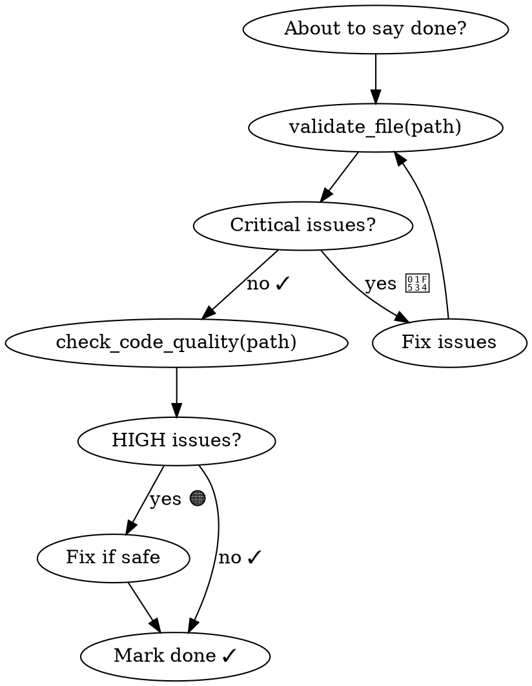

<HARD-GATE>
You are about to say "done", "fixed", "complete", or "implemented".
STOP. You have NOT verified the code yet.

Do NOT mark any task as done, do NOT commit, do NOT say the work is complete
until you have run BOTH validators below and fixed all 🔴 CRITICAL issues.

"It looks correct" is not verification. Run the tools.
</HARD-GATE>

## When to invoke

**INVOKE when:** about to say done/fixed/complete/implemented, before committing, before creating a PR
**DO NOT INVOKE for:** read-only tasks, pure research, config changes with no logic

## Steps



### 0. Get model recommendation
```
suggest_model(task_description="<paste the file path or description of what was written>")
```
Say: **"Using [model] — [reasoning]"** then proceed.

### 1. Validate logic correctness
```
validate_file(path="<file you wrote or modified>")
```
Fix every 🔴 CRITICAL issue. Re-run until clean.

### 2. Validate code quality
```
check_code_quality(path="<same file>")
```
Fix 🔴 HIGH severity issues. Address 🟠 MEDIUM where practical.

### 3. For complex logic — get the full checklist
```
get_checklist()
```
Run all 5 mental passes before marking done.

### 4. Pre-write validation (before writing to disk)
```
check_drift(code="<your code snippet>", language="typescript")
```

## Severity guide

| Icon | Level | Action |
|---|---|---|
| 🔴 | Critical/High | Fix immediately — do not proceed |
| 🟠 | Medium | Fix if the refactor is safe |
| 🔵 | Low/Info | Note for future cleanup |
