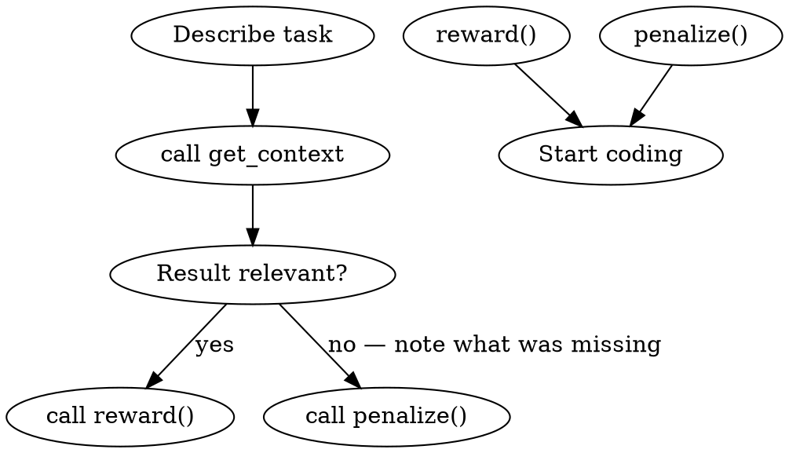

<HARD-GATE>
Do NOT open any source file, read any code, or start implementation
until you have called get_context and reviewed the result.
Reading files manually when Lucid is available wastes tokens and misses context.
</HARD-GATE>

## When to invoke this skill

**INVOKE when:** about to work on a feature, fix a bug, understand a module, or any coding task
**DO NOT INVOKE for:** pure conversation, reading docs, non-code questions

## Steps



### 1. Call get_context
```
get_context(query="<concise description of what you are working on>", maxTokens=4000)
```

Use `dirs` to narrow scope when you know the area:
```
get_context(query="...", dirs=["src/api"], maxTokens=4000)
```

### 2. Review results and give feedback

| Result quality | Action |
|---|---|
| Included the files you needed | `reward()` |
| Missed important files you had to find manually | `penalize(note="missed: src/path/file.ts")` |
| Partially useful | no action |

### 3. Supplement if needed

```
grep_code(pattern="functionName")          # locate specific usages
get_recent(hours=2)                        # after git pull — see what changed
recall(query="<topic>")                    # search accumulated knowledge
```

### 4. After finishing — sync

After every Write/Edit:
```
sync_file(path="<modified file>")
```
